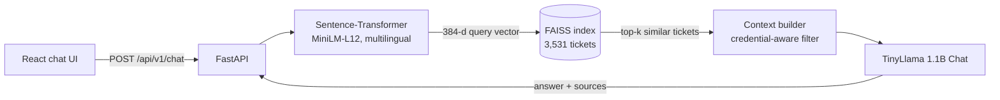

# Infotech Wizard

**A retrieval-augmented IT helpdesk assistant.** It answers support questions by
retrieving similar resolved tickets from a multilingual knowledge base, then
generating a short, step-by-step answer with a small local LLM. No external API
calls, so tickets never leave the machine.


[](https://github.com/Muhammadhammad24/Infotech-Wizard/actions/workflows/ci.yml)

## How it works


```mermaid
flowchart LR
    U[React chat UI] -- POST /api/v1/chat --> A[FastAPI]
    A --> E[Sentence-Transformer<br/>MiniLM-L12, multilingual]
    E -- 384-d query vector --> F[(FAISS index<br/>3,531 tickets)]
    F -- top-k similar tickets --> C[Context builder<br/>credential-aware filter]
    C --> L[TinyLlama 1.1B Chat]
    L -- answer + sources --> A
```

1. **Embed.** The question is embedded with a multilingual MiniLM model, so a
   German or Spanish question can match an English ticket, and the reverse.
2. **Retrieve.** FAISS returns the `top_k` most similar tickets by cosine
   similarity.
3. **Ground.** Account and password topics get extra handling: the context
   builder keeps only the relevant snippets, in English and German.
4. **Generate.** TinyLlama answers in 3–5 bullet points, with deterministic decoding so
   the same question gets the same answer.
5. **Cite.** The response includes the tickets it used and their scores.

### Knowledge base

| Tickets | Languages | Types |
| --- | --- | --- |
| 3,531 | English 1,218 · German 752 · Spanish 714 · French 428 · Portuguese 419 | Incident, Request, Problem, Change |

## Quick start

```bash
# 1. Install (CPU wheels are enough)
python -m venv .venv && source .venv/bin/activate
pip install torch --index-url https://download.pytorch.org/whl/cpu
pip install -r requirements.txt

# 2. Build the vector index from data/it_support_metadata.pkl (one-off, ~1 min)
python -m scripts.build_index

# 3. Run the API, with interactive docs at http://localhost:8000/docs
uvicorn main:app --reload

# 4. Run the chat UI at http://localhost:5173 (proxies /api to :8000)
cd frontend && npm install && npm run dev
```

Or with Docker, after step 2:

```bash
docker compose up --build
```

## API

`POST /api/v1/chat/`

```json
{ "query": "Wie setze ich mein Passwort zurück?", "top_k": 4, "max_tokens": 150 }
```

```json
{
  "response": "- Open Settings → Accounts\n- Choose Reset password\n- ...",
  "query": "Wie setze ich mein Passwort zurück?",
  "context_used": "…",
  "search_results": [
    { "subject": "Password reset request", "answer": "…", "score": 0.83, "metadata": { "queue": "IT Support" } }
  ],
  "processing_time": 1.42,
  "timestamp": "2025-09-09T10:30:00Z"
}
```

| Endpoint | Purpose |
| --- | --- |
| `GET /health` | Liveness and whether the models are loaded |
| `GET /api/v1/chat/health` | Per-component readiness: embeddings, index, LLM |
| `GET /docs` | OpenAPI UI |

Validation: `query` 1–2000 characters, `top_k` 1–20, `max_tokens` 50–500.
If the models aren't loaded yet, the API returns `503` rather than an empty answer.

## Configuration

All settings are environment variables (see [`.env.example`](.env.example)):

| Variable | Default | |
| --- | --- | --- |
| `LLM_MODEL_ID` | `TinyLlama/TinyLlama-1.1B-Chat-v1.0` | Any Hugging Face chat model |
| `EMBEDDING_MODEL` | `paraphrase-multilingual-MiniLM-L12-v2` | Must match the index |
| `TOP_K_RESULTS` | `4` | Tickets retrieved per question |
| `MAX_TOKENS` | `130` | Default answer length |
| `DEBUG` | `false` | When `false`, models warm up at startup |

## Project layout

```
app/
  api/routes/chat.py     HTTP layer, validation and error mapping
  services/              embeddings, FAISS store, LLM, orchestration
  models/                request and response schemas
  core/                  settings and logging
scripts/
  build_index.py         rebuilds the FAISS index from ticket metadata
  deploy.sh, stop.sh     Docker helpers
frontend/                React + Vite + Tailwind chat client
tests/                   API tests with the model layer faked out
```

## Tests

```bash
pip install -r requirements-dev.txt
pytest
```

The tests replace `ChatbotService` with a fake through FastAPI's dependency
overrides, so they cover routing, validation and error handling without
downloading any models. CI runs them on every push.

## Design notes

- **Local models only.** Support tickets often contain personal data. Keeping
  inference on the box avoids sending it to a third-party API.
- **Small generator, strong retriever.** Answer quality comes mostly from
  retrieval, so a 1.1B model is enough to rephrase grounded steps, and the
  whole stack runs on CPU within the 4 GB container limit.
- **Lazy loading.** Models load on first use, or at startup in production.
  Health endpoints report readiness separately, so orchestrators can wait for
  the service to be ready.

## Roadmap

- [ ] Streaming responses to the UI
- [ ] Retrieval evaluation set (recall@k) to compare embedding models
- [ ] Restrict CORS and add API-key auth for deployment
- [ ] Reply in the user's language instead of always in English
