# 🤖 IT Support Chatbot Backend API

<div align="center">

[](https://fastapi.tiangolo.com)
[](https://python.org)
[](https://pytorch.org)
[](https://huggingface.co/transformers)

**A high-performance REST API backend for an intelligent IT support chatbot powered by Retrieval-Augmented Generation (RAG)**

[Features](#-features) • [Quick Start](#-quick-start) • [API Reference](#-api-reference) • [Documentation](#-documentation)

</div>

---

## ✨ Features

<table>
<tr>
<td width="50%">

### 🧠 **AI-Powered**
- **RAG Architecture**: Retrieval-Augmented Generation with FAISS vector search
- **Multiple Models**: Support for various LLMs via HuggingFace Transformers
- **Smart Context**: Semantic search for relevant document retrieval

</td>
<td width="50%">

### ⚡ **High Performance**
- **FastAPI**: Async/await support with automatic documentation
- **Optimized Search**: FAISS-powered vector similarity search
- **Production Ready**: Comprehensive error handling and monitoring

</td>
</tr>
<tr>
<td width="50%">

### 🔒 **Security First**
- **Input Validation**: Pydantic models for request/response validation
- **Credential Filtering**: Automatic password/sensitive data detection
- **CORS Support**: Configurable cross-origin resource sharing

</td>
<td width="50%">

### 🐳 **DevOps Ready**
- **Docker Support**: Container-ready deployment
- **Health Checks**: Built-in monitoring and diagnostics
- **Auto Documentation**: Interactive Swagger UI at `/docs`

</td>
</tr>
</table>

---

## 🏗️ Architecture

```mermaid
graph TB
    Client[🌐 Client] --> FastAPI[⚡ FastAPI Server]
    FastAPI --> RAG[🧠 RAG Pipeline]
    RAG --> Retriever[🔍 Document Retriever]
    RAG --> Generator[📝 Response Generator]
    
    Retriever --> FAISS[(🗂️ FAISS Vector Store)]
    Retriever --> Embeddings[🔤 Sentence Transformers]
    Generator --> LLM[🤖 Language Model]
    
    FAISS --> Metadata[(📊 Document Metadata)]
    
    FastAPI --> Health[❤️ Health Checks]
    FastAPI --> Docs[📚 Auto Documentation]
```



---

## 🛠️ Technology Stack

<div align="center">

| Component | Technology | Version | Purpose |
|:---------:|:----------:|:-------:|:--------|
| **🌐 Web Framework** | FastAPI | 0.116.1 | High-performance async API server |
| **🔍 Vector Search** | FAISS | 1.12.0 | Efficient similarity search and clustering |
| **🔤 Embeddings** | Sentence-Transformers | 5.1.0 | Text embedding generation |
| **🤖 Language Models** | Transformers | 4.56.1 | LLM inference and text generation |
| **🔥 ML Backend** | PyTorch | 2.8.0 | Deep learning model execution |
| **✅ Data Validation** | Pydantic | 2.11.7 | Request/response validation |

</div>

---

## 📋 Prerequisites

<div align="center">

| Requirement | Minimum | Recommended |
|:-----------:|:-------:|:-----------:|
| **🐍 Python** | 3.8+ | 3.11+ |
| **💾 RAM** | 4GB | 8GB+ |
| **💿 Disk Space** | 1GB | 2GB+ |
| **🎮 GPU** | Optional | CUDA-compatible |

</div>

---

## 🚀 Quick Start

Choose your preferred deployment method:

<div align="center">

[](https://docker.com)
[](#local-setup)

</div>

---

## 🐳 Docker Deployment (Recommended)

### **Prerequisites**
- Docker Desktop installed and running
- Your FAISS data files in `./data/` directory

### **Quick Start**

```bash
# Clone and navigate
git clone <your-repository>
cd chatbot-backend

# Create required directories
mkdir cache logs

# Deploy with Docker Compose
docker-compose up -d
```

### **Docker Commands**

<details>
<summary><strong>🔧 All Docker Commands</strong></summary>

```bash
# Build and start services
docker-compose up -d --build

# View logs
docker-compose logs -f

# Stop services
docker-compose down

# Rebuild from scratch
docker-compose down
docker-compose build --no-cache
docker-compose up -d

# Check status
docker-compose ps
```

</details>

### **Test Docker Deployment**

```bash
# Health check
curl http://localhost:8000/health

# Chat endpoint
curl -X POST "http://localhost:8000/api/v1/chat/" \
     -H "Content-Type: application/json" \
     -d '{"query": "How do I reset my password?"}'
```

---

## 💻 Local Development Setup

### **1. Setup Environment**

```bash
# Clone repository
git clone <your-repository>
cd chatbot-backend

# Create virtual environment
python -m venv venv
source venv/bin/activate  # Windows: venv\Scripts\activate

# Install dependencies
pip install -r requirements.txt
```

### **2. Configuration**

```bash
# Copy environment template
cp .env.example .env
```

### **3. Prepare Data**

```
📁 data/
├── 🗂️ it_support_faiss_index.bin
├── 📊 it_support_metadata.pkl
└── ⚙️ it_support_config.json
```

### **4. Run Server**

```bash
# Development
uvicorn main:app --reload --host 0.0.0.0 --port 8000

# Production
gunicorn main:app -w 4 -k uvicorn.workers.UvicornWorker --bind 0.0.0.0:8000
```

---

## 📖 API Reference

### 🛣️ **Endpoints Overview**

<div align="center">

| Method | Endpoint | Description | Auth Required |
|:------:|:---------|:------------|:-------------:|
| `GET` | `/` | Root health check | ❌ |
| `GET` | `/health` | Detailed health status | ❌ |
| `POST` | `/api/v1/chat/` | Process chat query | ❌ |
| `GET` | `/api/v1/chat/health` | Chat service health | ❌ |

</div>

### 💬 **Chat API**

#### `POST /api/v1/chat/`

Process a user query and return an AI-generated response using RAG.

<details>
<summary><strong>📤 Request Format</strong></summary>

```json
{
  "query": "How do I reset my password on MacBook Air?",
  "top_k": 4,        // Optional: Number of context documents (1-20)
  "max_tokens": 150  // Optional: Max response length (50-500)
}
```

</details>

<details>
<summary><strong>📥 Success Response (200)</strong></summary>

```json
{
  "response": "To reset your password on MacBook Air:\n1. Go to System Preferences\n2. Click Users & Groups\n3. Select your user account\n4. Click 'Change Password'\n5. Follow the prompts",
  "query": "How do I reset your password on MacBook Air?",
  "context_used": "MacBook password reset process: Access System Preferences...",
  "search_results": [
    {
      "subject": "MacBook Password Reset",
      "answer": "System Preferences > Users & Groups...",
      "score": 0.89,
      "metadata": {"category": "macOS", "difficulty": "easy"}
    }
  ],
  "processing_time": 1.23,
  "timestamp": "2024-01-15T10:30:00Z"
}
```

</details>

<details>
<summary><strong>❌ Error Responses</strong></summary>

| Status Code | Description | Example Scenario |
|:-----------:|:------------|:-----------------|
| **400** | Bad Request | Invalid query format or parameters |
| **503** | Service Unavailable | Models not loaded or service not ready |
| **500** | Internal Server Error | Unexpected processing error |

```json
{
  "error": "Validation Error",
  "detail": "Query must be between 1 and 2000 characters",
  "timestamp": "2024-01-15T10:30:00Z"
}
```

</details>

---

## 🧪 Testing

### 🔍 **Service Diagnostics**

```bash
# Run comprehensive service tests
python test.py
```

**Tests Include:**
- ✅ Embedding service functionality
- ✅ FAISS database loading
- ✅ LLM service initialization
- ✅ Chatbot service integration

### 🚀 **Load Testing**

```bash
# Install testing dependencies
pip install pytest pytest-asyncio httpx locust

# Run unit tests
pytest tests/ -v

# Run load tests
locust -f tests/load_test.py --host=http://localhost:8000
```

---

## ⚙️ Configuration Reference

<details>
<summary><strong>🌍 Environment Variables</strong></summary>

| Variable | Default | Description |
|:---------|:--------|:------------|
| `API_V1_PREFIX` | `/api/v1` | API version prefix |
| `PROJECT_NAME` | `IT Support Chatbot` | Application name |
| `DEBUG` | `True` | Enable debug mode |
| `HOST` | `0.0.0.0` | Server bind address |
| `PORT` | `8000` | Server port |
| `LOG_LEVEL` | `INFO` | Logging level |
| `LLM_MODEL_ID` | `TinyLlama/TinyLlama-1.1B-Chat-v1.0` | HuggingFace model ID |
| `EMBEDDING_MODEL` | `paraphrase-multilingual-MiniLM-L12-v2` | Sentence transformer model |

</details>

<details>
<summary><strong>🤖 Supported Models</strong></summary>

**LLM Models:**
- `TinyLlama/TinyLlama-1.1B-Chat-v1.0` (default, lightweight)
- `google/gemma-2-2b-it` (better quality)
- `microsoft/DialoGPT-medium`

**Embedding Models:**
- `paraphrase-multilingual-MiniLM-L12-v2` (default, multilingual)
- `all-MiniLM-L6-v2` (English, faster)
- `all-mpnet-base-v2` (English, higher quality)

</details>

---

## 🚀 Performance & Scaling

### **📊 Optimization Strategies**

<table>
<tr>
<td width="50%">

#### **🔥 Performance**
- Model quantization for faster inference
- Response caching with Redis
- CPU-only inference for embeddings
- Batch processing for multiple queries

</td>
<td width="50%">

#### **📈 Scaling**
- Horizontal scaling with load balancers
- GPU acceleration for larger models
- Microservice architecture
- CDN for static assets

</td>
</tr>
</table>

### **📈 Monitoring**

- 📊 Built-in metrics and health checks
- 📝 Structured logging for observability
- ⏱️ Processing time tracking
- 🚨 Error rate monitoring

---

## 🔒 Security

### **🛡️ Built-in Security Features**

<div align="center">

| Feature | Description |
|:--------|:------------|
| **✅ Input Validation** | Pydantic models validate all inputs |
| **📏 Query Limits** | Prevents abuse with length restrictions |
| **🔐 Password Filtering** | Automatic credential detection |
| **🌍 CORS Configuration** | Configurable cross-origin settings |
| **🔍 Error Sanitization** | Prevents information leakage |

</div>

### **🔐 Production Security Checklist**

- [ ] Configure CORS origins appropriately
- [ ] Use HTTPS in production
- [ ] Implement rate limiting
- [ ] Set up API authentication
- [ ] Monitor security events
- [ ] Keep dependencies updated

---

## 🐛 Troubleshooting

<details>
<summary><strong>❌ Common Issues</strong></summary>

### **1. Models Not Loading**
```bash
# Error: No module named 'sentence_transformers'
pip install sentence-transformers
```

### **2. FAISS Index Not Found**
```bash
# Ensure FAISS index files exist in data directory
ls -la ./data/
```

### **3. Out of Memory**
```bash
# Force CPU usage
export CUDA_VISIBLE_DEVICES=""
```

### **4. Port Already in Use**
```bash
# Change port or kill existing process
export PORT=8001
# or
lsof -ti:8000 | xargs kill -9
```

</details>

---

## 🤝 Contributing

We welcome contributions! Please see our [Contributing Guidelines](CONTRIBUTING.md) for details.

<div align="center">

### **Development Setup**
```bash
pip install -r requirements-dev.txt
pre-commit install
```

### **Code Style**
[](https://github.com/psf/black)
[](https://pycqa.github.io/isort/)

</div>

---

## 📄 License

This project is licensed under the **MIT License** - see the [LICENSE](LICENSE) file for details.

---

## 🆘 Support & Documentation

<div align="center">

### **Need Help?**

[](../../issues)
[](/docs)
[](/health)

</div>

---

## 🗺️ Roadmap

### **🚀 Planned Features**

- [ ] 💾 Response caching with Redis
- [ ] 🌍 Multi-language support
- [ ] 🔐 Authentication and authorization
- [ ] 🔄 Real-time chat via WebSocket
- [ ] 📊 Admin dashboard for monitoring
- [ ] 🧪 A/B testing for different models
- [ ] 🔗 Integration with external knowledge bases
- [ ] 💾 Open ticket if user query not solved

---

<div align="center">

**Built with ❤️ using FastAPI, PyTorch, and HuggingFace Transformers**

⭐ **Star this repo if you find it helpful!** ⭐

</div>